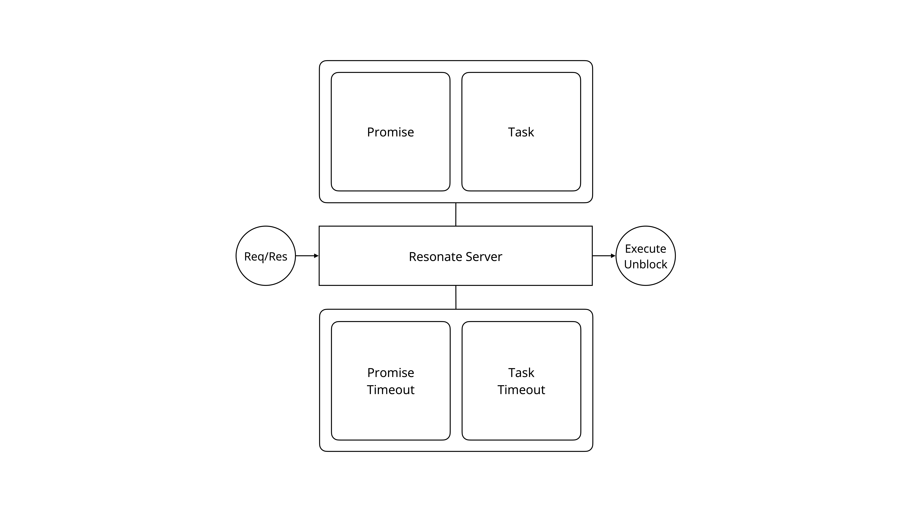

# Resonate Specification

The Resonate protocol, specified as an executable **abstract machine** in Lean 4: a state, a set of effects (atomic operations on the state) and a set of request handlers (transitions composed from effects). 

## The Machine

<p align="center">
  <picture>
    <source media="(prefers-color-scheme: dark)" srcset="docs/am-b.png">
    
  </picture>
</p>

### State

[`state.lean`](spec/01-objects/state.lean)

- **objects** — promises, tasks, and schedules
- **timeouts** — obligations the environment fires later, as internal transitions
- **outbox** — messages awaiting delivery: `execute` dispatches a task to a worker, `unblock` notifies a listener of a settled promise

Wire-level records and request/response types are in [`types.lean`](spec/01-objects/types.lean).

### Effects

The atomic operations of the machine ([`state.lean`](spec/01-objects/state.lean)) — lookups, keyed upserts, and deletes per state component:

| Component | Effects |
|---|---|
| promises | `getPromise` / `setPromise` |
| tasks | `getTask` / `setTask` |
| schedules | `getSchedule` / `setSchedule` / `delSchedule` |
| timeouts | `setPromiseTimeout` / `setTaskTimeout` / `setScheduleTimeout` / `del…Timeout` |
| outbox | `setMessage` |

Handlers touch state only through effects — the one exception is the settlement scrub, inlined at the three settlement sites. Together they are the contract a concrete implementation must realize.

### Handlers

Every handler is a pure function

```lean
Req → (now : Nat) → M Res    -- M = StateM ServerState
```

composed from effects. Deterministic and total; there is no hidden clock — time enters only through `now`.

Conventions the whole model leans on:

- **Projection** — a pending promise past `timeoutAt` is *observed* as already settled (`resolved` for timers, `rejectedTimedout` otherwise) even before its timeout transition persists that fact.

## Protocol Handlers

### Promises

| | Handler | Transition |
|---|---|---|
| P-01 | [`promise.get`](spec/02-actions/P-01-promise.get.lean) | Read a promise (with timeout projection). |
| P-02 | [`promise.create`](spec/02-actions/P-02-promise.create.lean) | Create a pending promise; a `resonate:target` tag also spawns a task and an `execute` message, optionally delayed. |
| P-03 | [`promise.settle`](spec/02-actions/P-03-promise.settle.lean) | Settle a pending promise: fulfill its task, notify listeners, resume awaiters. |
| P-04 | [`promise.register_callback`](spec/02-actions/P-04-promise.register_callback.lean) | Subscribe an awaiter promise for resume when the awaited promise settles. |
| P-05 | [`promise.register_listener`](spec/02-actions/P-05-promise.register_listener.lean) | Subscribe an address for an `unblock` message when the promise settles. |
| P-06 | [`promise.search`](spec/02-actions/P-06-promise.search.lean) | Not yet specified (`501`). |

### Tasks

| | Handler | Transition |
|---|---|---|
| T-01 | [`task.get`](spec/02-actions/T-01-task.get.lean) | Read a task (projected `fulfilled` once its promise is no longer pending). |
| T-02 | [`task.create`](spec/02-actions/T-02-task.create.lean) | Create a promise with an immediately-acquired task, or re-acquire an existing pending task. |
| T-03 | [`task.acquire`](spec/02-actions/T-03-task.acquire.lean) | Worker claims a pending task: bump version, arm the lease. |
| T-04 | [`task.fence`](spec/02-actions/T-04-task.fence.lean) | Run a `promise.create`/`promise.settle` guarded by the task's fencing token. |
| T-05 | [`task.heartbeat`](spec/02-actions/T-05-task.heartbeat.lean) | Extend the leases of a worker's acquired tasks. |
| T-06 | [`task.suspend`](spec/02-actions/T-06-task.suspend.lean) | Park an acquired task on awaited promises; `300` if any is already settled. |
| T-07 | [`task.fulfill`](spec/02-actions/T-07-task.fulfill.lean) | Settle the task's promise and fulfill the task in one transition. |
| T-08 | [`task.release`](spec/02-actions/T-08-task.release.lean) | Return an acquired task to pending and re-enqueue its `execute`. |
| T-09 | [`task.halt`](spec/02-actions/T-09-task.halt.lean) | Take a task out of circulation. |
| T-10 | [`task.continue`](spec/02-actions/T-10-task.continue.lean) | Return a halted task to pending and re-enqueue its `execute`. |
| T-11 | [`task.search`](spec/02-actions/T-11-task.search.lean) | Not yet specified (`501`). |

### Schedules

| | Handler | Transition |
|---|---|---|
| S-01 | [`schedule.get`](spec/02-actions/S-01-schedule.get.lean) | Read a schedule. |
| S-02 | [`schedule.create`](spec/02-actions/S-02-schedule.create.lean) | Create a schedule and arm its first fire. |
| S-03 | [`schedule.delete`](spec/02-actions/S-03-schedule.delete.lean) | Delete a schedule and disarm its timeout. |
| S-04 | [`schedule.search`](spec/02-actions/S-04-schedule.search.lean) | Not yet specified (`501`). |

### Internal Transitions

| Handler | Transition |
|---|---|
| [`resume`](spec/02-actions/00-resume.lean) | The settlement chain: wake a suspended awaiter (re-pending + `execute`) or record the resume on an active one. |
| [`timeouts`](spec/02-actions/02-timeouts.lean) | Environment-fired transitions: promise timeout, task retry, lease expiry, schedule fire (with catch-up). |

## Build

```
cd spec && lake build
```
