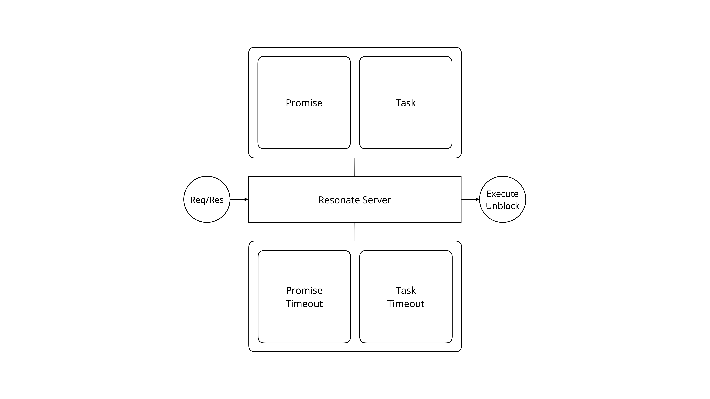

# Resonate Specification

The Resonate protocol, specified as an executable **abstract machine** in Lean 4: a state, a set of effects (atomic operations on the state), and a set of transitions composed from effects. This repository is the source of truth for the protocol; the Lean is authoritative.

## Your Task

You are an implementer — a developer or a coding agent. Your task is to derive an implementation on your target platform whose **observable behavior matches the observable behavior specified here**: for every request, the same response; for every transition, the same state change and the same emitted messages.

Within that constraint you are free to make implementation decisions. The spec fixes *what* every transition does; it deliberately does not fix your storage engine, transport, concurrency model, or when internal transitions run. What must match and what you decide are listed [below](#what-must-match-and-what-you-decide).

## The Machine

<p align="center">
  <picture>
    <source media="(prefers-color-scheme: dark)" srcset="docs/am-b.png">
    
  </picture>
</p>

### State

[`state.lean`](spec/01-objects/state.lean)

- **objects** — promises, tasks, and schedules
- **deferred** — resume obligations the server records at settlement and invokes on itself later
- **timeouts** — obligations the environment fires later, as τ-steps
- **outbox** — messages awaiting delivery: `execute` dispatches a task to a worker, `unblock` notifies a listener of a settled promise

Wire-level records and request/response types are in [`types.lean`](spec/01-objects/types.lean).

### Effects

The atomic operations of the machine ([`state.lean`](spec/01-objects/state.lean)) — lookups, keyed upserts, and deletes per state component:

| Component | Effects |
|---|---|
| promises | `getPromise` / `setPromise` |
| tasks | `getTask` / `setTask` |
| schedules | `getSchedule` / `setSchedule` / `delSchedule` |
| deferred | `defer` / `undefer` |
| timeouts | `setPromiseTimeout` / `setTaskTimeout` / `setScheduleTimeout` / `del…Timeout` |
| outbox | `setMessage` |

Transitions touch state only through effects. Together the effects are the contract your storage layer must realize. Settlement's write set, restricted to promises and tasks, is `{p.id}`: settle neither reads nor writes any promise but its own — resumes are recorded as deferred work, discharged by the drain.

### Transitions

The machine has two kinds of transitions, and the distinction carries the implementer's largest freedom:

- **Handlers** — request/response transitions. A client sends a `Req`, the machine responds with a `Res`. Every handler is a pure function `Req → (now : Nat) → M Res` (where `M = StateM ServerState`), deterministic and total; there is no hidden clock — time enters only through `now`.
- **τ-steps** — internal transitions with no request/response nature: no request consumed, no response produced. A τ-step is enabled by state alone (a due timeout, a non-empty deferred set); *you* decide when it fires, the spec decides what firing does. A client can never observe a τ-step directly, only its consequences in later responses and outbox messages.

Conventions the whole model leans on:

- **Projection** — a pending promise past `timeoutAt` is *observed* as already settled (`resolved` for timers, `rejectedTimedout` otherwise) even before its timeout τ-step persists that fact. Every promise-facing read projects; stored-vs-projected divergence is nowhere observable, which is what makes the materialization schedule yours to choose.
- **Validation** — anything rejectable by inspecting the request alone is `400`, with highest precedence: before existence, state, or version are consulted. Examples: settling to a non-settable state, self-await, duplicate or empty awaited lists, an untargeted `task.create` action, an undeliverable listener address.
- **Timeout always wins** — deadline guards re-check at fire time, so a late τ-step is always safe: an expired awaiter is never woken, its cleanup belongs to the timeout path.

## Handlers

### Promises

| | Handler | Transition |
|---|---|---|
| P-01 | [`promise.get`](spec/02-actions/P-01-promise.get.lean) | Read a promise (with timeout projection). |
| P-02 | [`promise.create`](spec/02-actions/P-02-promise.create.lean) | Create a pending promise; a `resonate:target` tag also spawns a task and an `execute` message, optionally delayed. |
| P-03 | [`promise.settle`](spec/02-actions/P-03-promise.settle.lean) | Settle a pending promise: fulfill its task, notify listeners, resume awaiters. |
| P-04 | [`promise.register_callback`](spec/02-actions/P-04-promise.register_callback.lean) | Subscribe an awaiter promise for resume when the awaited promise settles. |
| P-05 | [`promise.register_listener`](spec/02-actions/P-05-promise.register_listener.lean) | Subscribe an address for an `unblock` message when the promise settles. |
| P-06 | [`promise.search`](spec/02-actions/P-06-promise.search.lean) | Not yet specified (`501`). |

### Tasks

| | Handler | Transition |
|---|---|---|
| T-01 | [`task.get`](spec/02-actions/T-01-task.get.lean) | Read a task (projected `fulfilled` once its promise is no longer pending). |
| T-02 | [`task.create`](spec/02-actions/T-02-task.create.lean) | Create a promise with an immediately-acquired task, or re-acquire an existing pending task. |
| T-03 | [`task.acquire`](spec/02-actions/T-03-task.acquire.lean) | Worker claims a pending task: bump version, arm the lease. |
| T-04 | [`task.fence`](spec/02-actions/T-04-task.fence.lean) | Run a `promise.create`/`promise.settle` guarded by the task's fencing token. |
| T-05 | [`task.heartbeat`](spec/02-actions/T-05-task.heartbeat.lean) | Extend the leases of a worker's acquired tasks. |
| T-06 | [`task.suspend`](spec/02-actions/T-06-task.suspend.lean) | Park an acquired task on awaited promises; `300` if any is already settled. |
| T-07 | [`task.fulfill`](spec/02-actions/T-07-task.fulfill.lean) | Settle the task's promise and fulfill the task in one transition. |
| T-08 | [`task.release`](spec/02-actions/T-08-task.release.lean) | Return an acquired task to pending and re-enqueue its `execute`. |
| T-09 | [`task.halt`](spec/02-actions/T-09-task.halt.lean) | Take a task out of circulation. |
| T-10 | [`task.continue`](spec/02-actions/T-10-task.continue.lean) | Return a halted task to pending and re-enqueue its `execute`. |
| T-11 | [`task.search`](spec/02-actions/T-11-task.search.lean) | Not yet specified (`501`). |

### Schedules

| | Handler | Transition |
|---|---|---|
| S-01 | [`schedule.get`](spec/02-actions/S-01-schedule.get.lean) | Read a schedule. |
| S-02 | [`schedule.create`](spec/02-actions/S-02-schedule.create.lean) | Create a schedule and arm its first fire. |
| S-03 | [`schedule.delete`](spec/02-actions/S-03-schedule.delete.lean) | Delete a schedule and disarm its timeout. |
| S-04 | [`schedule.search`](spec/02-actions/S-04-schedule.search.lean) | Not yet specified (`501`). |

## τ-Steps

Exactly five exist ([`02-timeouts.lean`](spec/02-actions/02-timeouts.lean), [`03-resume.lean`](spec/02-actions/03-resume.lean)):

| τ-step | Enabled when | Firing does |
|---|---|---|
| `onPromiseTimeout` | a promise timeout is due | Settle the promise at its deadline (stamped `timeoutAt`, byte-identical to the projection), fulfill its task, notify listeners, defer resumes. |
| `onTaskRetryTimeout` | a pending task's retry is due | Re-arm the retry and re-enqueue the task's `execute`. |
| `onTaskLeaseTimeout` | an acquired task's lease is due | Return the task to pending, re-arm the retry, re-enqueue its `execute`. |
| `onScheduleTimeout` | a schedule's fire is due | Create the occurrence promise(s), catching up on missed occurrences, and re-arm the next fire. |
| `onResume` (via `drain`) | the deferred set is non-empty | Wake a suspended awaiter (re-pending + `execute`) or record the trigger on an active one; the deadline guard re-checks at drain time (timeout always wins). |

The only obligation on your τ-schedule is **weak fairness**: every continuously enabled τ-step eventually fires. Eager (inline within the triggering handler, the `step` combinator) and lazy (background workers, arbitrarily later) schedules are both admitted; the durable-execution guarantee ([`04-guarantee.lean`](spec/02-actions/04-guarantee.lean)) is stated over the τ-quotient precisely so that it holds at every stage of τ-lag.

## What Must Match, and What You Decide

**Must match** — the observable behavior:

- Every handler's validation order, status codes, response contents, state changes, and emitted messages.
- The projection on every promise-facing read.
- Timeout always wins: an awaiter past its own deadline is never woken.
- Wake conservation: a determined wake is held by some stage (callback → deferred → woken) in every state, until it materializes ([`04-guarantee.lean`](spec/02-actions/04-guarantee.lean)).
- Time enters only through `now`, sampled once per transition.

**You decide** — everything the spec deliberately leaves open:

1. **τ-schedule** — when timeouts fire and when the drain runs: inline cascade, background workers, DB triggers, periodic sweep. Only weak fairness is required.
2. **Projection materialization** — when (or whether) timed-out promises are physically settled; the projected record is byte-identical to what the timeout τ-step writes, so any schedule is conformant.
3. **Storage** — how the six state components map onto your platform's storage, realizing the effects' contract (lookup by id, keyed collapse-on-set).
4. **Atomicity and concurrency** — how concurrent requests are isolated, such that observable behavior is equivalent to some serial order of transitions.
5. **Durability and recovery** — persistence boundaries such that each transition is all-or-nothing; a partial write (promise settled, resumes lost) violates wake conservation.
6. **Transport and encoding** — HTTP/gRPC binding, URL scheme, field naming, serialization, authentication. The spec constrains only the abstract request/response types and statuses.
7. **Message delivery** — how outbox messages reach their addresses: push or poll, routing, retries. Delivery may be at-least-once and lossy; the task retry and lease τ-steps are the safety net.
8. **Clock** — units and source of `now` (the `retryTimeout := 5000` default reads as milliseconds).
9. **Cron and templates** — `nextCron` and `expand` are `opaque`: the cron dialect and promise-id template syntax are yours (or your ecosystem's).
10. **Configuration** — which knobs to expose beyond `retryTimeout`.

The search handlers (P-06, T-11, S-04) are not yet specified; the conformant behavior is `501`.

## Build

```
cd spec && lake build
```
